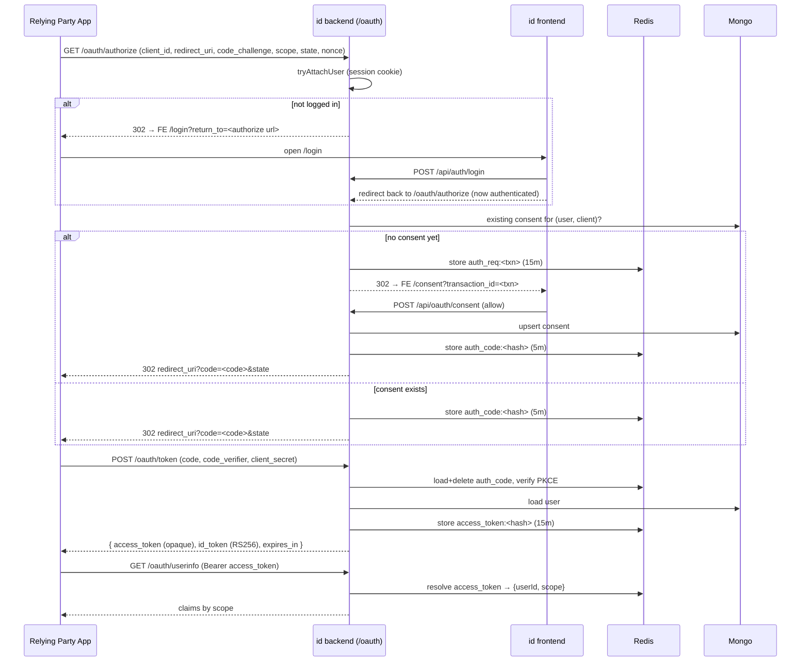

# feat: Internal OIDC Provider (universal SSO)

## Summary

Build a self-hosted **OpenID Connect provider** in the empty `id/` project to act as the
single universal login for all of the owner's internal projects. The provider implements the
**Authorization Code + PKCE** flow with OIDC discovery, JWKS, userinfo, RS256 ID tokens, and a
user consent screen.

The backend is **TypeScript** following the modules layout shared by `anand_oidc_mongo` and
`open_assets` (`src/app`, `src/common/{config,middleware,utils}`, `src/lib`,
`src/modules/<feature>/{controller,service,model,routes,middleware,dto}`). The OIDC engine is a
**port-and-adapt** of `anand_oidc_mongo`'s proven JavaScript implementation into TypeScript,
using `open_assets`' TS conventions (Zod DTOs, `ApiError`/`ApiResponse`, `asyncHandler`, helmet,
`tsx` runtime).

The frontend is **feature-based** Next.js following `open_assets`
(`src/app` route groups → thin pages, `src/features/<feature>/{components,hooks,services,context}`,
`src/components/ui`, `src/lib`, `src/types`). It ships the login and consent surfaces the OIDC
flow redirects to.

**Stack:** TypeScript · Express 5 · Mongoose (MongoDB) · ioredis (Redis) · node-jose (RS256) ·
Zod · Next.js (App Router) · React.

---

## Problem Frame

The owner runs several internal projects that each carry their own ad-hoc auth. The goal is one
identity service ("`id`") that every internal app delegates login to via standard OIDC, so there
is a single account, a single password, and a single session across all projects.

Because the audience is **internal only**:
- Users are **seeded/provisioned**, not signed up by the public.
- OAuth clients (the internal apps) are **registered via a seed script/service**, not a
  public self-service dashboard.
- The full multi-tenant management surface from `anand_oidc_mongo` (projects, admin dashboard,
  client CRUD UI, app suspension) is **out of scope** for v1 and deferred.

---

## Scope Boundaries

### In scope (v1)
- Authorization Code flow with **PKCE (S256 only)**.
- OIDC discovery document (`/.well-known/openid-configuration`) + JWKS endpoint.
- Token endpoint issuing opaque access token (Redis-backed) + RS256 ID token.
- Userinfo endpoint (Bearer access token → claims by scope).
- Scopes: `openid`, `profile`, `email`.
- First-party auth: login, logout, session refresh, `me`, password hashing.
- Consent screen (first authorization per client) + stored consent.
- Seed scripts: one admin user (owner's email) + internal OAuth clients.
- RSA signing key bootstrap (env PEM, file PEM, or ephemeral dev key).

### Deferred to Follow-Up Work
- Admin dashboard + OAuth client CRUD UI (use seed script for v1).
- Projects / multi-tenancy model from `anand_oidc_mongo`.
- App suspension, client-secret rotation UI, usage analytics.
- Email verification + password-reset flows (the model carries the fields; wiring deferred).
- Public self-service user registration.

### Outside this product's identity
- Acting as an OAuth **client** to third-party IdPs (Google, GitHub social login).
- Non-OIDC protocols (SAML, plain OAuth2 without `openid`).
- Refresh-token **grant** at the OAuth layer (the first-party cookie session handles staying
  logged in; downstream apps re-run the short auth-code flow, which is silent when an `id`
  session already exists).

---

## Requirements

| ID | Requirement |
|----|-------------|
| R1 | A relying-party app can complete Authorization Code + PKCE against `id` and receive a valid ID token. |
| R2 | `id` exposes a spec-correct discovery document and JWKS so clients can self-configure and verify tokens. |
| R3 | ID tokens are RS256-signed; the signing key is configurable and stable across restarts in production. |
| R4 | A user authenticates once at `id`; subsequent authorize calls reuse the session (no re-login) and skip consent once granted. |
| R5 | The token endpoint rejects: wrong client secret, bad PKCE verifier, `redirect_uri` mismatch, reused/expired code. |
| R6 | The userinfo endpoint returns only the claims permitted by the granted scope. |
| R7 | Users and OAuth clients are provisioned by seed scripts (owner email seeded as admin). |
| R8 | Backend folder structure matches the reference modules layout; frontend matches the feature-based layout. |

---

## High-Level Technical Design

*This illustrates the intended approach and is directional guidance for review, not implementation
specification. The implementing agent should treat it as context, not code to reproduce.*

Authorization Code + PKCE flow across `id` backend (`:4000`) and `id` frontend (`:3000`):



**Token model (ported from anand):**
- Authorization code: random base64url, only its SHA-256 **hash** is stored in Redis (`auth_code:<hash>`, 5 min).
- Access token: opaque random base64url, SHA-256 hash stored in Redis (`access_token:<hash>`, 15 min) → userinfo resolves it.
- ID token: RS256 JWT signed by `node-jose` with the active `kid`; claims gated by scope (`email`, `email_verified`, `name`).
- First-party app session: short-lived access JWT + httpOnly refresh cookie, session whitelisted in Redis (`session:<userId>:<sid>`).

---

## Output Structure

```
id/
├── docker-compose.yml                # mongo + redis for local dev
├── backend/
│   ├── package.json                  # tsx + TS, "type": "module"
│   ├── tsconfig.json                 # mirror open_assets (Bundler, strict)
│   ├── Dockerfile
│   ├── .env.example
│   ├── index.ts                      # entry: connectDB → redis.ping → initOidcKeys → seed → listen
│   ├── scripts/
│   │   ├── generate-oidc-keys.sh
│   │   ├── seed-admin.ts             # owner email → admin user
│   │   └── seed-clients.ts           # register internal apps
│   ├── cert/                         # gitignored RSA PEM (dev)
│   └── src/
│       ├── app.ts                    # express app factory, route mounts, discovery, error handler
│       ├── common/
│       │   ├── config/{db.ts,redis.ts,email.ts}
│       │   ├── middleware/{validate.middleware.ts,errorHandler.ts,rateLimit.ts}
│       │   └── utils/{ApiError.ts,ApiResponse.ts,asyncHandler.ts,jwt.utils.ts,crypto.utils.ts,keys.utils.ts}
│       └── modules/
│           ├── auth/
│           │   ├── auth.controller.ts
│           │   ├── auth.service.ts
│           │   ├── auth.model.ts
│           │   ├── auth.routes.ts
│           │   ├── auth.middleware.ts
│           │   └── dto/{register.schema.ts,login.schema.ts}
│           ├── oauth-client/
│           │   ├── oauth-client.model.ts
│           │   └── oauth-client.service.ts
│           └── oauth/
│               ├── oauth.controller.ts
│               ├── oauth.service.ts
│               ├── oauth.routes.ts          # /oauth/authorize,/token,/userinfo,/jwks
│               ├── oauth-api.routes.ts      # /api/oauth/consent*
│               ├── oauth-consent.controller.ts
│               ├── oauth-access.middleware.ts
│               ├── oidc-discovery.controller.ts
│               ├── consent.model.ts
│               └── dto/consent-decision.schema.ts
└── frontend/
    ├── package.json                  # Next.js App Router
    ├── tsconfig.json
    └── src/
        ├── app/
        │   ├── layout.tsx            # wraps AuthProvider
        │   ├── globals.css
        │   ├── (auth)/
        │   │   ├── layout.tsx
        │   │   ├── login/page.tsx
        │   │   └── consent/page.tsx
        │   └── (account)/
        │       └── account/page.tsx  # minimal "logged in" landing
        ├── features/
        │   ├── auth/
        │   │   ├── context/AuthContext.tsx
        │   │   ├── hooks/useAuth.ts
        │   │   ├── services/authApi.ts
        │   │   └── components/LoginForm.tsx
        │   └── consent/
        │       ├── services/consentApi.ts
        │       └── components/ConsentCard.tsx
        ├── components/ui/            # button, input, card, label
        ├── lib/{api-client.ts,token-store.ts,oauth-resume.ts,utils.ts}
        └── types/index.ts
```

The tree is a scope declaration, not a constraint — per-unit `**Files:**` are authoritative.

---

## Key Technical Decisions

- **Port, don't reinvent.** The OIDC engine (`oauth.service`, `keys.utils`, `crypto.utils`,
  `oauth-access.middleware`, models) is a near-verbatim TS translation of `anand_oidc_mongo`.
  Rationale: it is already spec-correct and battle-tested; rewriting invites subtle PKCE/token bugs.
  *(see reference: `anand_oidc_mongo/backend/src/modules/oauth/oauth.service.js`)*
- **TS conventions from `open_assets`.** Use `ApiError` class + `ApiResponse` + `asyncHandler` +
  `errorHandler` + Zod `validate` middleware + `helmet`, not anand's JS `api-error`/Joi style.
  Controllers are thin; services hold logic.
- **Drop the `project`/tenancy layer.** anand threads `projectId` through every client operation.
  Internal-only scope doesn't need it — `oauth-client` carries `ownerId` only (or no owner at all
  for v1 seeded clients). This removes the largest chunk of ported complexity.
- **Provisioning via scripts, not UI.** `seed-admin.ts` + `seed-clients.ts` replace the admin
  dashboard. Clients print their secret once at creation.
- **Redis is required** (not optional) — auth codes, access tokens, auth requests, and sessions
  all live there, exactly as in anand.
- **`module: Preserve` + `tsx`** runtime (no build step), matching `open_assets/tsconfig.json`.

---

## Implementation Units

### U1. Backend scaffold + common layer

**Goal:** Stand up the TS Express app skeleton with config, utils, middleware, and a `/health`
route — runnable with `pnpm dev`, no business logic yet.

**Requirements:** R8.

**Dependencies:** none.

**Files:**
- `backend/package.json`, `backend/tsconfig.json`, `backend/.env.example`, `backend/Dockerfile`
- `docker-compose.yml` (mongo + redis)
- `backend/index.ts` (entry; for now: `connectDB` → `redis.ping` → `createApp().listen`)
- `backend/src/app.ts` (express factory, helmet, cors, json limit, cookieParser, `/health`, error handler)
- `backend/src/common/config/{db.ts,redis.ts}`
- `backend/src/common/utils/{ApiError.ts,ApiResponse.ts,asyncHandler.ts}`
- `backend/src/common/middleware/{errorHandler.ts,validate.middleware.ts,rateLimit.ts}`

**Approach:** Copy `open_assets` `app.ts`/`index.ts`/`db.ts`/`redis.ts`/`ApiError.ts`/
`ApiResponse.ts`/`asyncHandler.ts`/`errorHandler.ts`/`validate.middleware.ts` near-verbatim;
strip worker/bullmq imports. CORS origin from `FRONTEND_URL` + localhost.

**Patterns to follow:** `open_assets/backend/src/app.ts`, `.../index.ts`, `.../common/*`.

**Test scenarios:**
- `GET /health` returns 200 `{ status: 'OK' }`.
- Unknown route → 404 via error handler with `{ success: false }`.
- A thrown `ApiError.badRequest('x')` in a stub route surfaces as 400 `{ success:false, message:'x' }`.
- `Test expectation:` minimal — scaffold unit; one smoke test on health + error handler.

**Verification:** `pnpm dev` boots, connects to Mongo + Redis, `/health` responds; `pnpm typecheck` clean.

---

### U2. OIDC key + crypto infrastructure

**Goal:** RSA signing key bootstrap, JWKS document, ID-token signing, and PKCE/token crypto helpers.

**Requirements:** R3 (advances R1, R2).

**Dependencies:** U1.

**Files:**
- `backend/src/common/utils/keys.utils.ts` (`getOidcIssuer`, `initOidcKeys`, `getJwksDocument`, `getKeyId`, `signIdToken`)
- `backend/src/common/utils/crypto.utils.ts` (`pkceChallengeS256`, `verifyPkce`, `randomBase64Url`, `hashToken`)
- `backend/scripts/generate-oidc-keys.sh`
- `backend/cert/` (gitignored), `.gitignore` entry
- wire `initOidcKeys()` into `backend/index.ts` startup

**Approach:** Direct TS port of anand's `keys.utils.js` + `crypto.utils.js`. Key resolution order:
`OIDC_RSA_PRIVATE_KEY` env → `OIDC_RSA_PRIVATE_KEY_PATH` → `cert/private-key.pem` → ephemeral dev key
(warn). `node-jose` for JWKS + JWS compact RS256. Add `@types/node-jose`.

**Technical design:** `signIdToken(claims)` → `jose.JWS.createSign({format:'compact', fields:{alg:'RS256',typ:'JWT',kid}})`. Directional only.

**Patterns to follow:** `anand_oidc_mongo/backend/src/common/utils/{keys.utils.js,crypto.utils.js}`.

**Test scenarios:**
- `pkceChallengeS256(verifier)` matches a known RFC 7636 test vector.
- `verifyPkce(verifier, challenge)` true for matching pair, false for mismatch and for empty inputs (constant-time path).
- `hashToken` is stable + hex; `randomBase64Url` has no `+/=` chars.
- After `initOidcKeys()`, `getJwksDocument().keys[0]` has `kid`, `use:'sig'`, `alg:'RS256'`, no private fields (`d`).
- `signIdToken({...})` produces a compact JWT whose signature verifies against the JWKS public key.

**Verification:** A unit test signs an ID token and verifies it with the published JWKS key.

---

### U3. Auth module (first-party identity + sessions)

**Goal:** User model, register/login/logout/refresh/`me`, JWT + Redis session layer, and the
`authenticate` / `tryAttachUser` / `authorize` middleware the OIDC authorize endpoint depends on.

**Requirements:** R4, R7 (advances R1).

**Dependencies:** U1.

**Files:**
- `backend/src/modules/auth/auth.model.ts` (User: name, email unique, password `select:false`, role enum, isVerified, profile fields; `pre('save')` bcrypt hash; `comparePassword`)
- `backend/src/modules/auth/auth.service.ts`
- `backend/src/modules/auth/auth.controller.ts`
- `backend/src/modules/auth/auth.routes.ts`
- `backend/src/modules/auth/auth.middleware.ts`
- `backend/src/modules/auth/dto/{register.schema.ts,login.schema.ts}`
- `backend/src/common/utils/jwt.utils.ts`
- `backend/src/common/config/email.ts` (stub; verification/reset deferred)
- mount `/api/auth` in `app.ts`

**Approach:** Port anand's `auth.middleware.js` (`authenticate`, `tryAttachUser`, `authorize`) and
the session-whitelist pattern (`session:<id>:<sid>` in Redis, httpOnly refresh cookie + short access
JWT) to TS. DTOs use Zod (open_assets style) instead of Joi. `register` exists but is for internal
provisioning; rate-limit with `authLimiter`.

**Patterns to follow:** `anand_oidc_mongo/.../auth/{auth.model.js,auth.middleware.js,auth.routes.js}`;
`open_assets/.../auth/{auth.route.ts,dto/*.schema.ts}`.

**Execution note:** Implement `authenticate`/`tryAttachUser` test-first — the OIDC authorize flow's
correctness (logged-in vs anonymous branch) hinges on them.

**Test scenarios:**
- Register hashes password; stored user has no plaintext password and `password` not returned by default.
- Login with correct creds → returns access token + sets refresh cookie + whitelists session in Redis.
- Login with wrong password → 401.
- `authenticate`: valid token + whitelisted session → `req.user` populated; missing token → 401; valid token but session not whitelisted → 401 + cookies cleared.
- `tryAttachUser`: valid session attaches `req.user`; no/invalid token → proceeds anonymous (no throw).
- `authorize('admin')` blocks a `user` role with 403.
- Refresh-token endpoint issues a new access token when the refresh cookie is valid.

**Verification:** Integration test drives register → login → `me` → logout; revoked session rejected.

---

### U4. OAuth client module + provisioning

**Goal:** OAuth client model + service (create with hashed secret, lookup, secret verification),
and a seed script to register internal apps. No public CRUD.

**Requirements:** R7 (advances R1, R5).

**Dependencies:** U1, U2 (uses `randomBase64Url`).

**Files:**
- `backend/src/modules/oauth-client/oauth-client.model.ts` (clientId unique, clientSecretHash `select:false`, clientName, redirectUris[], description, logoUrl, suspended; **no projectId**)
- `backend/src/modules/oauth-client/oauth-client.service.ts` (`create`, `findByClientId({withSecret})`, `verifyClientSecret`)
- `backend/scripts/seed-clients.ts`
- `backend/scripts/seed-admin.ts` (owner email → role `admin`, `isVerified:true`)
- `package.json` scripts: `seed:admin`, `seed:clients`, `oidc:generate-keys`

**Approach:** Port a **slimmed** `oauth-client.service.js` — drop all `project`/owner-scoping methods
(`createForProject`, `listByProject`, `assertProjectOwner`, …). Keep `makeClientId` (`cl_…`),
`makeClientSecret`, bcrypt hash, `findByClientId`, `verifyClientSecret`. Seed script prints the raw
secret once.

**Patterns to follow:** `anand_oidc_mongo/.../oauth-client/{oauth-client.model.js,oauth-client.service.js}` (minus project layer).

**Test scenarios:**
- `create({clientName, redirectUris})` returns a plaintext secret once; DB stores only the bcrypt hash.
- `findByClientId(id)` omits the secret hash by default; `{withSecret:true}` includes it.
- `verifyClientSecret(client, raw)` true for correct secret, false for wrong, false when hash absent.
- `redirectUris` rejects an empty array (model validation).
- `seed-admin` is idempotent — re-running does not duplicate the user.

**Verification:** Run `seed:admin` + `seed:clients`; confirm one admin user and the seeded clients exist with hashed secrets.

---

### U5. OIDC core flows (authorize, consent, token, userinfo, discovery, JWKS)

**Goal:** The full Authorization Code + PKCE engine and OIDC endpoints — the heart of the provider.

**Requirements:** R1, R2, R4, R5, R6.

**Dependencies:** U2, U3, U4.

**Files:**
- `backend/src/modules/oauth/oauth.service.ts` (`getAuthorize`, `runAuthorize`, `issueAuthCode`, `exchangeToken`, `getUserinfo`, `loadConsentContext`, `completeConsent`)
- `backend/src/modules/oauth/oauth.controller.ts`
- `backend/src/modules/oauth/oauth.routes.ts` (`GET /jwks`, `GET /authorize` [`tryAttachUser`], `POST /token`, `GET /userinfo` [`authenticateOidcAccess`])
- `backend/src/modules/oauth/oauth-api.routes.ts` (`GET /api/oauth/consent/context`, `POST /api/oauth/consent` — both `authenticate`)
- `backend/src/modules/oauth/oauth-consent.controller.ts`
- `backend/src/modules/oauth/oauth-access.middleware.ts` (`authenticateOidcAccess`)
- `backend/src/modules/oauth/oidc-discovery.controller.ts` (`getOpenIdConfiguration`, `getJwks`)
- `backend/src/modules/oauth/consent.model.ts` (unique `{userId, clientId}`)
- `backend/src/modules/oauth/dto/consent-decision.schema.ts` (Zod: `transaction_id`, `decision` ∈ allow|deny)
- mount `/oauth`, `/api/oauth` in `app.ts`; mount discovery at `/.well-known/openid-configuration`

**Approach:** Port `oauth.service.js`, `oauth-access.middleware.js`, `oidc-discovery.controller.js`,
`consent.model.js`, `oauth-consent.controller.js`, `oauth.routes.js`, `oauth-api.routes.js` to TS.
Drop the `client.suspended` branches only if U4 omits the field (keep them if it's retained — cheap).
Drop `logAuthCodeIssued` admin-metrics (or keep as a no-op). Redis keys identical:
`auth_req:<txn>:<userId>`, `auth_code:<hash>`, `access_token:<hash>`. Issuer/redirect bases from env
(`OIDC_ISSUER`, `OIDC_LOGIN_REDIRECT_BASE`, `OIDC_CONSENT_REDIRECT_BASE`, `FRONTEND_URL`).

**Patterns to follow:** `anand_oidc_mongo/.../oauth/*` (verbatim semantics).

**Execution note:** Start with a failing end-to-end test of the authorize→token→userinfo contract
before porting internals — it's the acceptance gate for the whole provider.

**Test scenarios:**
- *Discovery:* `GET /.well-known/openid-configuration` returns issuer + all 4 endpoint URLs, `response_types_supported:['code']`, `code_challenge_methods_supported:['S256']`, `id_token_signing_alg_values_supported:['RS256']`.
- *JWKS:* `GET /oauth/jwks` returns the public key with `kid` matching signed tokens; no private fields.
- *Authorize validation:* missing `code_challenge`/`state`/`client_id` → 400; `response_type!='code'` → 400; scope without `openid` → 400; `code_challenge_method!='S256'` → 400.
- *Authorize anonymous:* no session → 302 to `FRONTEND_URL/login?return_to=<authorize url>`.
- *Authorize unknown client / bad redirect_uri:* unknown `client_id` → 400; `redirect_uri` not in client list → 400.
- *Authorize first time:* logged in, no prior consent → stores `auth_req` in Redis, 302 to `/consent?transaction_id=…`.
- *Authorize returning:* logged in, consent exists → 302 to `redirect_uri?code=…&state=…`.
- *Consent context:* `GET /api/oauth/consent/context?transaction_id` returns client name + scope; expired txn → 400.
- *Consent allow:* upserts consent, returns `redirect_url` with `code` + `state`.
- *Consent deny:* returns `redirect_url` with `error=access_denied` + `state`, no code.
- *Token happy path:* valid code + verifier + client secret → `{access_token, id_token, token_type:'Bearer', expires_in:900, scope}`; ID token verifies against JWKS with correct `iss/sub/aud`.
- *Token PKCE fail:* wrong `code_verifier` → 400 `invalid_grant`.
- *Token replay:* reusing a code (deleted after first use) → 400 `invalid_grant`.
- *Token mismatches:* `redirect_uri` mismatch → 400 `invalid_grant`; wrong client secret → 401 `invalid_client`; `grant_type!='authorization_code'` → 400 `unsupported_grant_type`.
- *ID token claims:* `email`/`email_verified` present only with `email` scope; `name` only with `profile` scope; `nonce` echoed when supplied.
- *Userinfo:* valid Bearer access token → `sub` + scope-gated claims; missing/invalid token → 401 with `WWW-Authenticate` header.

**Verification:** A real OIDC client library (or scripted flow) completes authorize→token→userinfo
and validates the ID token signature/claims against discovery + JWKS.

---

### U6. Frontend scaffold + API/auth foundation

**Goal:** Next.js App Router project with the feature-based layout, API client (token store +
silent refresh), `AuthProvider`, base UI primitives, and the OIDC `return_to` resume helper.

**Requirements:** R8 (advances R1, R4).

**Dependencies:** U3 (auth API contract).

**Files:**
- `frontend/package.json`, `frontend/tsconfig.json`, `frontend/next.config.ts`, `frontend/postcss.config.mjs`, `frontend/components.json`
- `frontend/src/app/{layout.tsx,globals.css}`
- `frontend/src/lib/{api-client.ts,token-store.ts,utils.ts,oauth-resume.ts}`
- `frontend/src/features/auth/context/AuthContext.tsx`
- `frontend/src/features/auth/hooks/useAuth.ts`
- `frontend/src/features/auth/services/authApi.ts`
- `frontend/src/components/ui/{button.tsx,input.tsx,card.tsx,label.tsx}`
- `frontend/src/types/index.ts`

**Approach:** Port `open_assets` `lib/api-client.ts` (in-flight-shared silent refresh on 401),
`token-store.ts`, and `AuthContext.tsx` near-verbatim. `oauth-resume.ts` reads `return_to` from the
URL after login and redirects the browser back to `/oauth/authorize` (port anand's
`lib/oauth-resume.ts` idea). Root `layout.tsx` wraps `AuthProvider`.

**Patterns to follow:** `open_assets/frontend/src/{lib/api-client.ts,lib/token-store.ts,features/auth/context/AuthContext.tsx}`.

**Test scenarios:**
- `api-client` retries once after a 401 by calling refresh, then replays the request.
- Concurrent 401s share a single refresh call (no stampede).
- `Test expectation: light` — most coverage is the integration flow in U7/U8; add one unit test on the refresh-dedup behavior.

**Verification:** `pnpm dev` serves the app; `AuthProvider` restores session on load without crashing when logged out.

---

### U7. Login surface (`(auth)` route group)

**Goal:** The login page the OIDC authorize endpoint redirects anonymous users to, with
`return_to`-aware resume so the OAuth flow continues after sign-in.

**Requirements:** R1, R4.

**Dependencies:** U6.

**Files:**
- `frontend/src/app/(auth)/layout.tsx`
- `frontend/src/app/(auth)/login/page.tsx` (thin — renders the feature component)
- `frontend/src/features/auth/components/LoginForm.tsx`
- `frontend/src/app/(account)/account/page.tsx` (minimal authenticated landing for direct visits)

**Approach:** `LoginForm` calls `useAuth().login`, then if a `return_to` query param is present uses
`oauth-resume.ts` to navigate the browser to it (re-entering `/oauth/authorize` now authenticated);
otherwise routes to `/account`. Pages stay thin per the feature-based convention.

**Patterns to follow:** `open_assets/frontend/src/app/(auth)/login/page.tsx`; anand's
`(auth)/login/{page.tsx,login-form.tsx}` for `return_to` handling.

**Test scenarios:**
- Submitting valid creds calls the login API and, with `?return_to=<url>`, redirects to that URL.
- Without `return_to`, redirects to `/account`.
- Invalid creds surface the API error message inline; no redirect.
- Visiting `/login` while already authenticated with a `return_to` resumes immediately.

**Verification:** Manual: start an authorize request from a test client → land on `/login` → sign in →
bounce back and receive a code at the client's `redirect_uri`.

---

### U8. Consent surface (`(auth)/consent`)

**Goal:** The consent screen that reads `transaction_id`, shows the requesting client + scopes, and
posts the allow/deny decision.

**Requirements:** R4, R6.

**Dependencies:** U5 (consent API), U6.

**Files:**
- `frontend/src/app/(auth)/consent/page.tsx` (thin; reads `transaction_id` search param)
- `frontend/src/features/consent/services/consentApi.ts`
- `frontend/src/features/consent/components/ConsentCard.tsx`

**Approach:** On load, `consentApi.getContext(transaction_id)` → render client name, description, logo,
and requested scopes. Allow/Deny → `consentApi.decide(...)` → follow the returned `redirect_url`
(back to the client's `redirect_uri` with `code` or `error`). Port anand's
`(auth)/consent/{page.tsx,consent-client.tsx}`.

**Patterns to follow:** `anand_oidc_mongo/frontend/src/app/(auth)/consent/*`.

**Test scenarios:**
- Valid `transaction_id` renders client name + the exact requested scopes.
- Expired/invalid `transaction_id` shows an error state (API 400), no decision buttons active.
- "Allow" posts `decision:'allow'` and navigates to the returned `redirect_url` (contains `code`).
- "Deny" posts `decision:'deny'` and navigates to a `redirect_url` containing `error=access_denied`.
- Missing `transaction_id` param renders an error rather than calling the API.

**Verification:** Full manual E2E: client → authorize → login → consent allow → client receives code →
client exchanges for tokens successfully.

---

## System-Wide Impact

| Surface | Impact |
|---------|--------|
| Internal apps (relying parties) | Each must be registered as an OAuth client (seed script) and implement the standard code+PKCE client side. New shared dependency on `id` uptime. |
| Redis | Now load-bearing for auth (codes, tokens, sessions) — not just a cache. Must persist/restart-survive appropriately. |
| Signing key (`OIDC_RSA_PRIVATE_KEY`) | A real secret in production; rotation invalidates live ID tokens until clients refetch JWKS. Document in `.env.example`. |
| CORS / cookies | Frontend (`:3000`) and API (`:4000`) cross-origin; cookie `SameSite`/domain config matters once deployed to real hosts. |

---

## Risk Analysis & Mitigation

| Risk | Likelihood | Impact | Mitigation |
|------|-----------|--------|------------|
| PKCE/token logic subtly broken in TS port | Med | High | Port verbatim; gate U5 with an end-to-end authorize→token→userinfo test against a real OIDC client lib. |
| Ephemeral dev signing key leaks into prod | Low | High | `keys.utils` throws in `NODE_ENV=production` when no persistent PEM is configured (ported behavior). |
| Open redirect via unchecked `redirect_uri` | Low | High | `assertRedirect` validates against the client's registered `redirectUris` allowlist (ported). |
| Redis down → all auth fails | Med | High | `index.ts` pings Redis at boot and fails fast; document the hard dependency. |
| `return_to` abused for open redirect on `/login` | Med | Med | `oauth-resume` should only honor `return_to` values pointing at this provider's own `/oauth/authorize` (same-origin check). |
| Scope drift between FE `types` and BE | Low | Low | Keep `frontend/src/types/index.ts` annotated as mirroring backend, as `open_assets` does. |

---

## Dependencies / Prerequisites

- MongoDB + Redis available locally (`docker-compose.yml` provides both).
- Node 22 + pnpm.
- An RSA keypair for production (`pnpm oidc:generate-keys` or env PEM).
- Decide the production issuer URL (`OIDC_ISSUER`) before registering real clients.

---

## Deferred Implementation Notes (resolve during execution)

- Exact Zod schema field constraints (mirror anand's Joi DTOs once porting).
- Whether to keep the `suspended` client field in v1 (cheap to keep; decide at U4).
- Final cookie `domain`/`SameSite` once deployment hosts are known.
- Email/verification wiring (`email.ts` is a stub until the deferred flows are built).
- Whether `/register` is exposed publicly or admin-gated (default: keep but rate-limited; revisit if team self-signup isn't wanted).
